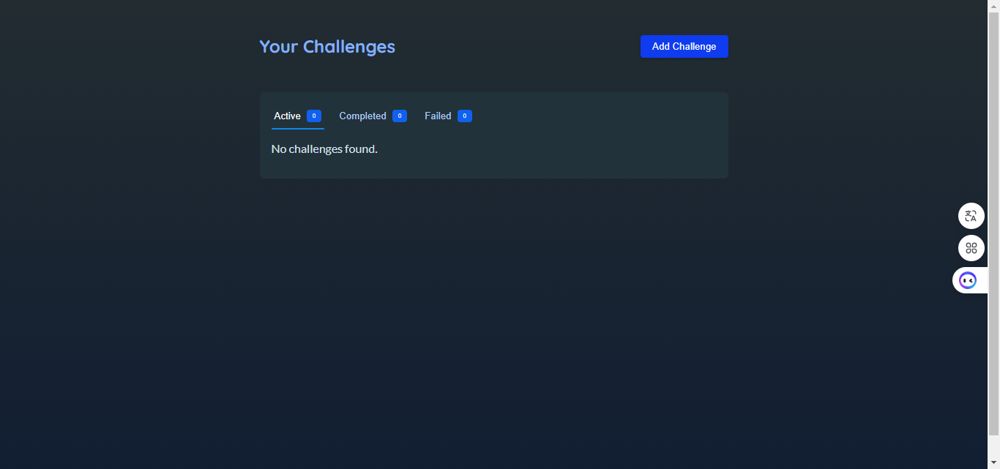
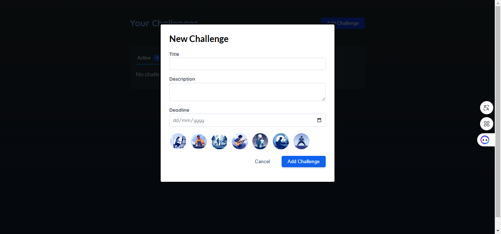
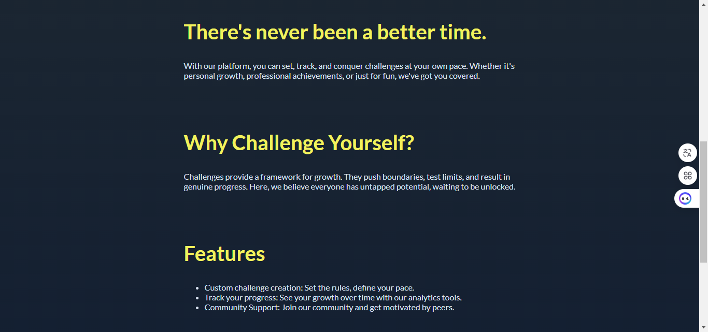
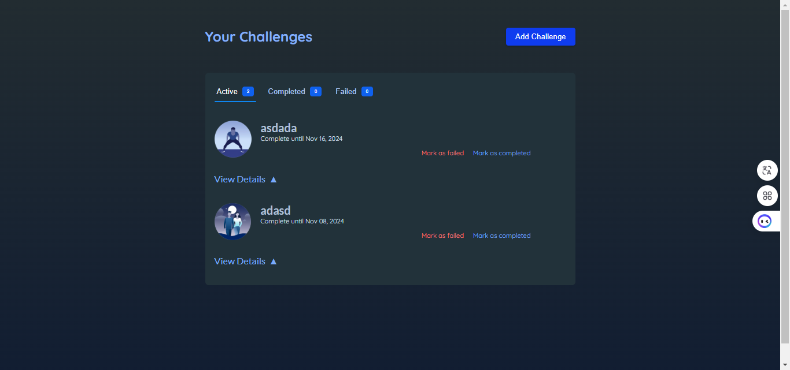

# Animating React Apps







## Introduction

**Animating React Apps** is a project created to learn how to use animations in React. This project aims to demonstrate how to integrate smooth dynamic effects, enhancing user experience through libraries like **Framer Motion**. You will learn how to create complex movements and interactive animations to make your React applications more lively and engaging.

## Installation

Follow the steps below to set up and run the project locally:

1. **Clone this repository:**
    ```bash
    git clone https://github.com/minh-dev1801/react-project.git
    ```
2. **Navigate to the project directory and install dependencies:**
    ```bash
    cd animating-react-apps
    npm install
    ```
3. **Start the application:**
    ```bash
    npm run dev
    ```
4. **Open the app:**
    Open your browser and go to [http://localhost:5173](http://localhost:5173).

## Technologies Used

- **Framer Motion**: A library used to create smooth animation effects in React. Below are some of the main features and components of Framer Motion utilized in this project:
  
  - **AnimatePresence**: Manages the mounting and unmounting of components, enabling smooth entrance and exit animations.
  - **initial**: Sets the initial state of the animation, allowing you to define properties such as height, opacity, etc.
  - **animate**: Defines the states that the animation will perform when the component is rendered.
  - **exit**: Defines the animation when the component is unmounted; must be used within `AnimatePresence` to manage the exit transition.
  - **transition**: Sets transition properties like duration, delay, ease, etc.
  - **mode="wait"**: Waits for the current animation to finish before starting the next one.
  - **layoutId="tab-indicator"**: Links layouts between different components to create smooth transition effects.
  - **whileHover**: Triggers an animation when the element is hovered over.
  - **variants**: Defines different states for the animation, such as `initial`, `animate`, and `exit`.
  - **useAnimate**: A hook used to create and manage animations within a component.
  - **stagger**: Creates a delay between animations, allowing them to overlap slightly rather than running completely simultaneously.
  - **useTransform**: A hook used to transform animation values based on other values.
  - **useScroll**: A hook used to monitor and respond to scroll events, which can trigger animations when the user scrolls to a certain position.
