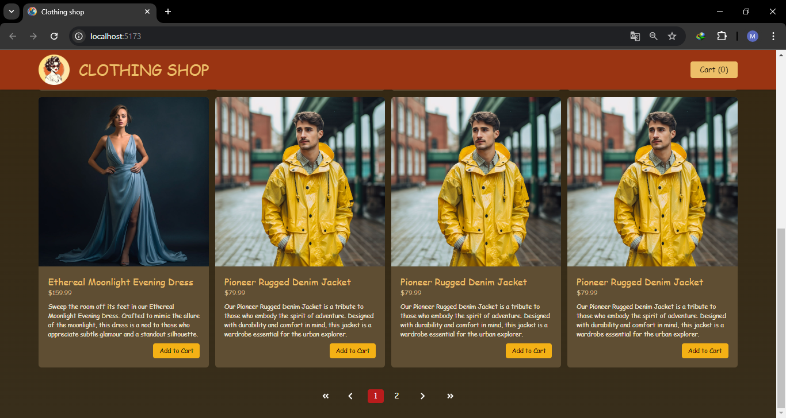

# Elegant Wardrobe




## Giới thiệu

Elegant Wardrobe là một theme với 2 tính năng: thêm sản phẩm vào giỏ hàng và tăng số lượng sản phẩm trong giỏ.

## Tính năng

- **Xem sản phẩm**: Hiển thị sản phẩm trên màn hình.
- **Thêm vào giỏ hàng**: Thêm sản phẩm vào giỏ hàng.
- **Tăng số lượng**: Tăng số lượng sản phẩm trong giỏ.
- **Giỏ hàng Modal**: Hiển thị modal giỏ hàng khi thêm số lượng sản phẩm.
- **Tìm kiếm**: Khi tiềm kiếm tên sản phẩm, danh sách sản phẩm sẽ hiện ra màn hình.
- **Phân trang**: Mỗi trang sẽ có 8 sản phẩm và phân trang là phân trang động.

## Cài đặt

Thực hiện các bước sau để thiết lập và chạy dự án cục bộ:

1. **Clone this repository:**
   ```bash
   git clone https://github.com/minh-dev1801/elegant-wardrobe.git

   ```
2. **Install dependencies:**

   ```bash
   npm install

   ```

3. **Start the application:**

   ```bash
   npm run dev

   ```

4. **Open the app:**
   ```bash
   Go to http://localhost:5173 in your browser.
   ```

## Công nghệ sử dụng

- **useState**: Quản lý sản phẩm và quản lý giỏ hàng.
- **forwardRef, useImperativeHandle, useRef**: Được sử dụng để tạo component modal giỏ hàng.
- **Tailwind CSS**: Giao diện người dùng của dự án được viết bằng thư viện Tailwind CSS.
- **Pagination**: Phân trang được tạo là phân trang động.
- **Search**: Tìm kiếm theo tên sản phẩm
- **Data**: Dữ liệu sản phẩm được lưu trong file data.js
- **State**: Quản lý các state của dự án bằng Redux tool kit.
