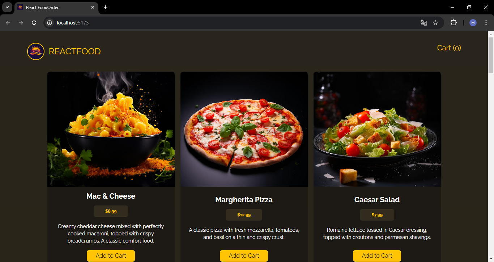
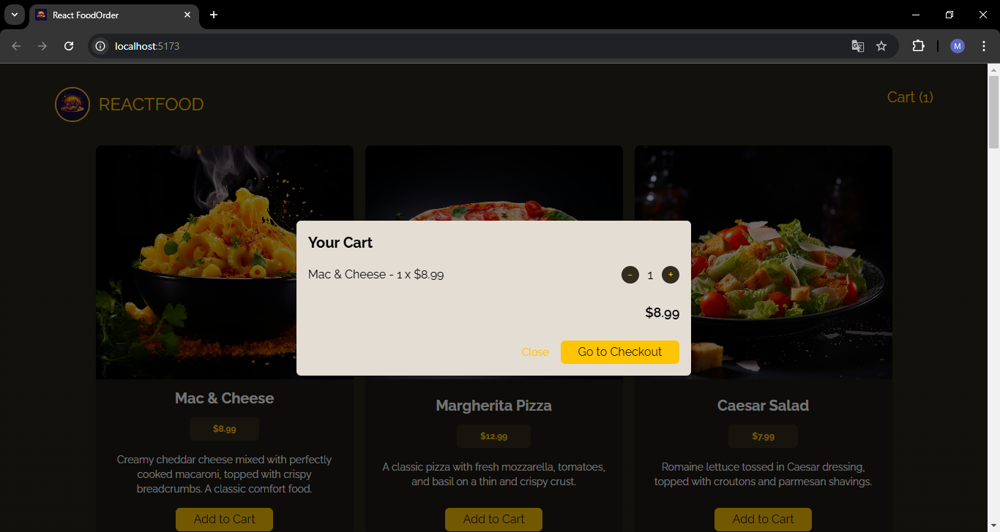
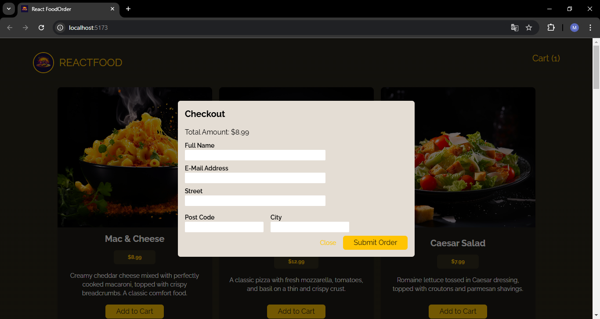
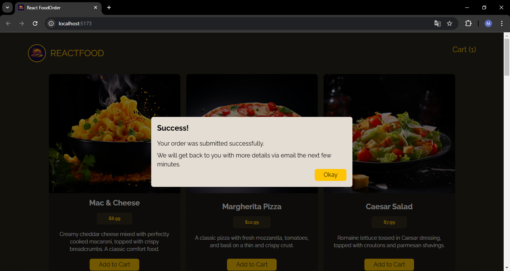

# Food Order App






## Giới thiệu

Food Order App là một ứng dụng đặt các món ăn trực tuyến, giúp người dùng dễ dàng lựa chọn, thêm vào giỏ hàng và thanh toán các món ăn yêu thích từ các nhà hàng địa phương. Ứng dụng cung cấp giao diện thân thiện, tính năng quản lý giỏ hàng hiệu quả và tích hợp hệ thống backend để xử lý đơn hàng.

## Tính năng

- **Xem món ăn**:

  - Lấy dữ liệu bằng cách dùng HTTP Requests từ backend.
  - Hiển thị các món ăn trên màn hình từ file dữ liệu giả (mock data).

- **Thêm món ăn vào giỏ hàng**:

  - Hiện pop-up để tăng hoặc giảm số lượng món ăn.
  - Tính tổng tiền tự động mỗi khi thay đổi số lượng.
  - Sử dụng state để lưu dữ liệu tạm thời, không ảnh hưởng đến backend nếu chưa gửi.

- **Xóa món ăn khỏi giỏ hàng**:

  - Giảm số lượng món ăn về 0 sẽ tự động xóa khỏi giỏ hàng.
  - Sử dụng state để quản lý dữ liệu tạm thời.

- **Thanh toán**:
  - Nhập thông tin khách hàng vào form.
  - Gửi thông tin khách hàng kèm theo món ăn lên backend bằng phương thức POST.
  - Backend sẽ ghi dữ liệu vào file dữ liệu giả.

## Cài đặt

Thực hiện các bước sau để thiết lập và chạy dự án cục bộ:

1. **Clone this repository:**

   ```bash
   git clone https://github.com/minh-dev1801/react-project.git

   ```

2. **Install dependencies:**

```bash

cd react-project/food-order-app
npm install

cd backend
npm install
```

3. **Start the application:**

```bash
# Trong thư mục food-order-app
npm run start

# Trong thư mục backend
nodemon server.js

```

4. **Open the app:**
   ```bash
   Go to http://localhost:5173 in your browser.
   Go to http://localhost:5000 to open backend.
   ```

## Công nghệ sử dụng

- **Tailwind CSS**: Sử dụng để xây dựng giao diện người dùng với các lớp tiện ích, giúp thiết kế nhanh chóng và linh hoạt.
- **Data**: Dữ liệu địa điểm và món ăn được lưu trữ trong file JSON tại backend.
- **ExpressJS**: Sử dụng để xây dựng backend, cung cấp các API routes cho client sử dụng.
- **React useEffect**: Sử dụng để tạo side effects như đóng modal tự động bằng `setInterval` và `setTimeout`.
- **React State Management**: Quản lý trạng thái của ứng dụng bằng React Context để chia sẻ dữ liệu giữa các component.
- **Fetch API**: Sử dụng `fetch` cùng với `async/await` để tương tác với backend.
- **Mô hình MVC**: Backend được thiết kế theo mô hình MVC để phân chia rõ ràng các thành phần Model, View và Controller.
- **Create Modal**: Sử dụng `createPortal` từ React để tạo các modal hiển thị trên giao diện.
