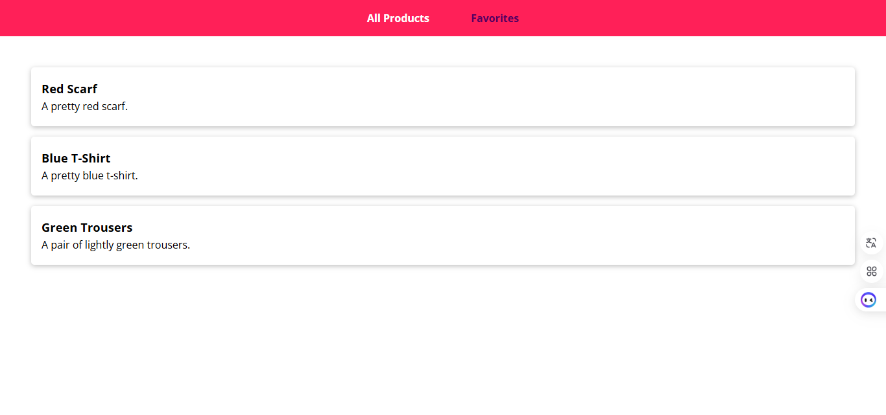
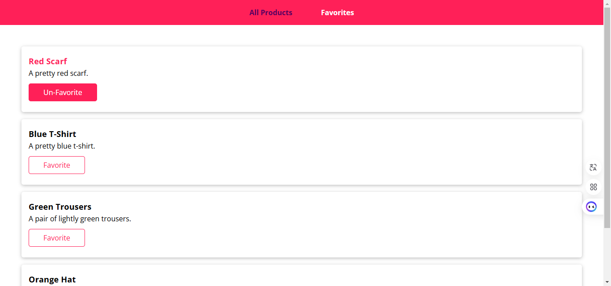

# Replacing Redux




## Introduction

**Replacing Redux** is a project demonstrating state management implementation using custom hooks in React. This project showcases a custom store hook pattern as an alternative to Redux for managing global state. Through practical examples, you will learn how to implement efficient state management and component communication in React applications.

Key features demonstrated:

- Custom store hook for global state management
- Efficient component updates and re-rendering
- State actions and dispatch pattern
- Component composition with shared state

## Installation

Follow the steps below to set up and run the project locally:

1. **Clone this repository:**
   ```bash
   git clone https://github.com/minh-dev1801/react-project.git
   ```
2. **Navigate to the project directory and install dependencies:**
   ```bash
   cd replacing-redux
   npm install
   ```
3. **Start the application:**
   ```bash
   npm run dev
   ```
4. **Open the app:**
   Open your browser and go to [http://localhost:5173](http://localhost:5173).

## Technologies Used

1. **Custom Store Hook Pattern**: 
   - Implemented in `hooks-store/store.js`
   - Provides global state management without Redux
   - Uses React hooks (useState, useEffect) for state updates
   - Example: `useStore()` hook for accessing and updating state

2. **Component Composition Pattern**: 
   - Used in Product and Favorite components
   - Components: ProductItem, FavoriteItem, Card
   - Provides reusable UI components and consistent styling

3. **State Management Implementation**:
   - Global state for products and favorites
   - Dispatch actions to update state
   - Example:
     ```jsx
     // Toggle favorite status
     const toggleFavHandler = () => {
       dispatch("TOGGLE_FAV", props.id);
     };

     // Access global state
     const state = useStore()[0];
     const favoriteProducts = state.products.filter(p => p.isFavorite);
     ```

4. **Performance Optimization**:
   - React.memo() for preventing unnecessary re-renders
   - Selective store subscription with shouldListen parameter
   - Example implementation:
     ```jsx
     // Optimized component with memo
     const ProductItem = React.memo(props => {
       const dispatch = useStore(false)[1];
       // Component logic
     });
     ```
   - Benefits:
     - Improved rendering performance
     - Optimized state updates
     - Better memory management
