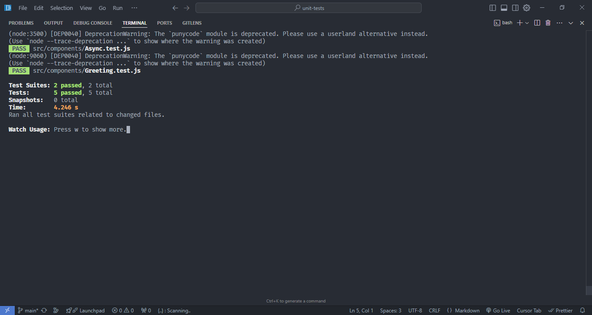

# Unit Tests



## Introduction

**Unit Tests** is a project demonstrating the implementation of unit testing in React. This project presents methods and techniques for writing effective unit tests for React components and custom hooks. Through practical examples, you will learn how to write and organize unit tests systematically.

Key features presented:

- Writing unit tests for React components
- Testing custom hooks and business logic
- Using Jest and React Testing Library
- Mocking functions and dependencies in testing

## Installation

Follow the steps below to set up and run the project locally:

1. **Clone this repository:**
   ```bash
   git clone https://github.com/minh-dev1801/react-project.git
   ```
2. **Navigate to the project directory and install dependencies:**
   ```bash
   cd unit-tests
   npm install
   ```
3. **Start the application:**
   ```bash
   npm run dev
   ```
4. **Open the app:**
   Open your browser and go to [http://localhost:5173](http://localhost:5173).

## Technologies Used

1. **Testing Libraries & Tools**: 
   - Jest: Main testing framework
   - React Testing Library: Testing library for React components
   - @testing-library/hooks: Testing custom hooks
   - @testing-library/user-event: Simulate user interactions

2. **Testing Patterns & Approaches**: 
   - Component Testing: Test render output and user interactions
   - Hook Testing: Test custom hooks independently
   - Integration Testing: Test interactions between components
   - Mock Testing: Simulate API calls and external dependencies

3. **Testing Best Practices**:
   - Arrange-Act-Assert pattern
   - Independent and reusable test cases
   - Example:
     ```jsx
     describe('ProductComponent', () => {
       it('should render product details correctly', () => {
         // Arrange
         render(<ProductComponent {...mockProps} />);
         
         // Act
         const productTitle = screen.getByText(/product name/i);
         
         // Assert
         expect(productTitle).toBeInTheDocument();
       });
     });
     ```

4. **Testing Coverage & Quality**:
   - Jest coverage reports
   - Unit tests for critical business logic
   - Integration tests for user flows
   - Example configuration:
     ```jsx
     // jest.config.js
     module.exports = {
       collectCoverageFrom: [
         'src/**/*.{js,jsx}',
         '!src/index.js',
       ],
       coverageThreshold: {
         global: {
           statements: 80,
           branches: 80,
           functions: 80,
           lines: 80,
         }
       }
     };
     ```
   - Benefits:
     - Early detection of errors during development
     - Ensure code quality
     - Document application behavior
